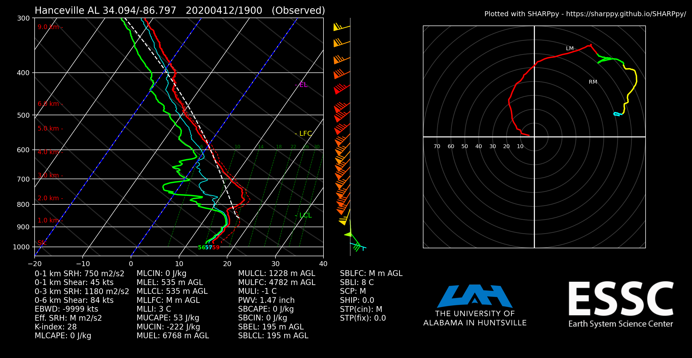

# The UAH Sounding Program

Dean Meyer and Preston Pangle

The University of Alabama in Huntsville (UAH)

2020

## What is it?

The UAH Sounding Program (USP) converts raw radiosonde data into several formats and generates [SHARPpy](https://sharppy.github.io/SHARPpy/)-based Skew-T Log-P plots. It leverages several Python libraries (NumPy, Pandas, Matplotlib, SHARPpy) to convert raw iMet or Windsond files into formats compatible with [RAOB](https://www.raob.com/), SHARPpy, and a general research format. Windsond data is processed with Pandas for quality-control and ease of viewing. USP also outputs custom SHARPpy plots serving as quick-looks for your data.

---

## Running the program

If you're just here to run USP, look no further. Follow these instructions to deploy USP to your system:

1. Navigate to **Releases** on this GitHub repo.
1. **Download** the latest release.
1. **Unzip** the downloaded release.
1. Locate the USP .exe file inside the release folder.
1. This guide recommends creating a shortcut for the USP .exe on the Desktop.
1. **Execute** the .exe to run USP.

*Note:* USP will dump converted sounding files and images to *C:/Converted_Soundings*

---

## Development

This section provides instructions to support future development of USP.

### Building the Anaconda environment

Original development of USP lived on Anaconda. The *sharppy* library requires its own Anaconda environment. To build this environment, enter this command in Anaconda prompt:

`conda env create -f sharppy-env-pyinst.yml`

The created environment also includes PyInstaller, allowing future developers to release .exe applications.

### Building the USP .exe

USP may run from the command line, but it runs best as a .exe application. When future developers update USP's scripts, they will need to rebuild the USP .exe with PyInstaller. Follow these steps to rebuild USP:

1. Through Anaconda prompt, navigate to the USP project folder.
1. Switch to the correct Conda environment by entering `conda activate sharppy-env-pyinst`
1. **Build USP** with the command `pyinstaller UAH_sounding_conversion_plotting.py`
1. *Note:* As of June 2020, using PyInstaller's `--onefile` option makes USP unstable and is not recommended.
1. A few new files appear, including a *dist* directory. *dist* contains the directory *UAH_sounding_conversion_plotting* which contains several files including the .exe.
1. **Copy *logo.png* and *essc_logo.png* into *dist/UAH_sounding_conversion_plotting/*. USP will not run without these.**
1. USP is now built.
1. Rename the directory *UAH_sounding_conversion_plotting* to *UAH Sounding Program.*
1. Attach this directory to new GitHub releases.
